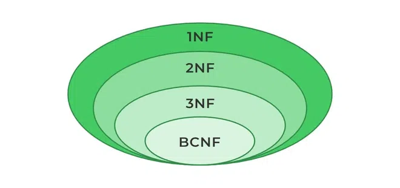

<!--  -->

### Praktik Normalisasi Database
---

**Software yang dibutuhkan** :
- **MySQL/ MariaDB server**, bisa juga XAMPP dan sejenisnya
- **HeidiSQL** (sebagai database client GUI versi desktop agar sat-set), bisa juga phpMyAdmin (database client GUI versi browser), boleh juga **Navicat** dan sejenisnya.

---

**Memulai Pekerjaan**
Aktifkan MySQL/ Mariadb server, lalu buka HeidiSQL atau sejenisnya.


Membuat database baru
```sql
create database db_pelatihan;
```

Menaktifkan `db_pelatihan`
```sql
use db_pelatihan;
```
Membuat tabel `pelatihan`
```sql
create table pelatihan(
    id_peserta char(3) not null primary key,
    nama_peserta varchar(30),
    no_hp char(12),
    alamat varchar(50),
    kelas varchar(30),
    instruktur varchar (30),
    jadwal varchar(50)
);
```

Memasukkan data ke dalam tabel `pelatihan`
```sql
insert into pelatihan values
("P01","Andi","08123456789","Jl. Melati 1","Python, Excel","Budi, Siti","Senin 10.00, Rabu 09.00"),
("P02","Budi","08234567890","Jl. Mawar 3","Python","Budi","Senin 10.00"),
("P03","Citra","08121234123","Jl. Kenanga 2","Python, Web","Budi, Wawan","Senin 10.00, Selasa 13.00"),
("P04","Dewi","08561234567","Jl. Teratai 4","Excel","Siti","Rabu 09.00"),
("P05","Eko","08134561234","Jl. Melati 2","Web","Wawan","Selasa 13.00"),
("P06","Fani","08216547890","Jl. Mawar 2","Python, Web, Excel","Budi, Wawan, Siti","Senin 10.00, Selasa 13.00, Rabu 09.00"),
("P07","Gina","08321456789","Jl. Anggrek 3","Data Analyst","Agus","Kamis 14.00"),
("P08","Hadi","08432178965","Jl. Teratai 5","Data Analyst","Agus","Kamis 14.00"),
("P09","Intan","08127654321","Jl. Melati 4","Excel","Siti","Rabu 09.00"),
("P10","Joko","08215678932","Jl. Mawar 1","Python, Data Analyst","Budi, Agus","Senin 10.00, Kamis 14.00");
```

Menampilkan data di dalam tabel `pelatihan`
```sql
select * from pelatihan;
```


**Masalah:**
Kolom Kelas, Instruktur, dan Jadwal mengandung multiple values → belum atomic (belum bentuk 1NF). 

---
**Normalisasi 1NF**


Membuat tabel baru `1nf_pelatihan`
```sql
create table 1nf_pelatihan(
    id_peserta char(3) not null,
    nama_peserta varchar(30),
    no_hp char(12),
    alamat varchar(50),
    kelas varchar(30),
    instruktur varchar (30),
    jadwal varchar(50)
);
```

Memasukkan data `1nf_pelatihan`
```sql
insert into 1nf_pelatihan values
("P01","Andi","08123456789","Jl. Melati 1","Python","Budi","Senin 10.00"),
("P01","Andi","08123456789","Jl. Melati 1","Excel","Siti","Rabu 09.00"),
("P02","Budi","08234567890","Jl. Mawar 3","Python","Budi","Senin 10.00"),
("P03","Citra","08121234123","Jl. Kenanga 2","Python","Budi","Senin 10.00"),
("P03","Citra","08121234123","Jl. Kenanga 2","Web","Wawan","Selasa 13.00"),
("P04","Dewi","08561234567","Jl. Teratai 4","Excel","Siti","Rabu 09.00"),
("P05","Eko","08134561234","Jl. Melati 2","Web","Wawan","Selasa 13.00"),
("P06","Fani","08216547890","Jl. Mawar 2","Python","Budi","Senin 10.00"),
("P06","Fani","08216547890","Jl. Mawar 2","Web","Wawan","Selasa 13.00"),
("P06","Fani","08216547890","Jl. Mawar 2","Excel","Siti","Rabu 09.00"),
("P07","Gina","08321456789","Jl. Anggrek 3","Data Analyst","Agus","Kamis 14.00"),
("P08","Hadi","08432178965","Jl. Teratai 5","Data Analyst","Agus","Kamis 14.00"),
("P09","Intan","08127654321","Jl. Melati 4","Excel","Siti","Rabu 09.00"),
("P10","Joko","08215678932","Jl. Mawar 1","Python","Budi","Senin 10.00"),
("P10","Joko","08215678932","Jl. Mawar 1","Data Analyst","Agus","Kamis 14.00");
```
Menampilkan data di dalam tabel `1nf_pelatihan`
```sql
select * from 1nf_pelatihan;
```


---

**Normalisasi 2NF**
Hilangkan *partial dependency* → bagi tabel agar setiap atribut non-kunci hanya tergantung pada seluruh *primary key*.

Membuat tabel `2nf_peserta`
```sql
create table 2nf_peserta(
    id_peserta char(3) not null,
    nama_peserta varchar(30),
    no_hp char(12),
    alamat varchar(50)
);
```

Memasukkan data `2nf_peserta`
```sql
insert into 2nf_peserta values
("P01","Andi","08123456789","Jl. Melati 1"),
("P02","Budi","08234567890","Jl. Mawar 3"),
("P03","Citra","08121234123","Jl. Kenanga 2"),
("P04","Dewi","08561234567","Jl. Teratai 4"),
("P05","Eko","08134561234","Jl. Melati 2"),
("P06","Fani","08216547890","Jl. Mawar 2"),
("P07","Gina","08321456789","Jl. Anggrek 3"),
("P08","Hadi","08432178965","Jl. Teratai 5"),
("P09","Intan","08127654321","Jl. Melati 4"),
("P10","Joko","08215678932","Jl. Mawar 1");
```
Menampilkan data `2nf_peserta`
```sql
select * from 2nf_peserta
```


Membuat tabel `2nf_kelas`
```sql
create table 2nf_kelas(
    kode_kelas char(3) not null,
    nama_kelas varchar(30),
    nama_instruktur varchar (30),
    jadwal varchar(50)
);
```

Memasukkan data `2nf_kelas`
```sql
insert into 2nf_kelas values
("K01","Python","Budi","Senin 10.00"),
("K02","Excel","Siti","Rabu 09.00"),
("K03","Web","Wawan","Selasa 13.00"),
("K04","Data Analyst","Agus","Kamis 14.00");
```

Menampilkan data tabel `2nf_kelas`
```sql
select * from 2nf_kelas;
```


Membuat tabel relasi `2nf_peserta_kelas`
```sql
create table 2nf_peserta_kelas(
    id_peserta char(3) not null,
    kode_kelas char(3) not null
);
```

Memasukkan data tabel relasi `2nf_peserta_kelas`
```sql
insert into 2nf_peserta_kelas values
("P01","K01"),
("P01","K02"),
("P02","K02"),
("P03","K01"),
("P03","K03"),
("P04","K02"),
("P05","K03"),
("P06","K01"),
("P06","K03"),
("P06","K02"),
("P07","K04"),
("P08","K04"),
("P09","K02"),
("P10","K01"),
("P10","K04");
```

Menampilkan data tabel `2nf_peserta_kelas`
```sql
select * from 2nf_peserta_kelas;
```


**Test Query-1**
Mengambil data join 3 tabel secara penuh
```sql
SELECT * FROM 2nf_peserta a
LEFT JOIN 2nf_peserta_kelas b
ON a.id_peserta = b.id_peserta
LEFT JOIN 2nf_kelas c
ON b.kode_kelas = c.kode_kelas
ORDER by a.id_peserta
```


**Test Query-2**
Mengambil data join 3 tabel dan dikelompokkan `nama_kelas` nya berdasarkan `id_peserta`
```sql
SELECT a.id_peserta,a.nama_peserta,a.no_hp,a.alamat,
GROUP_CONCAT(c.nama_kelas) AS nama_kelas FROM 2nf_peserta a
LEFT JOIN 2nf_peserta_kelas b
ON a.id_peserta = b.id_peserta
LEFT JOIN 2nf_kelas c
ON b.kode_kelas = c.kode_kelas
GROUP BY a.id_peserta
ORDER by a.id_peserta
```


---

**Normalisasi 3NF**
- Syarat : sudah 2NF
- Hilangkan *transitive dependency*

Membuat tabel `3nf_instruktur`
```sql
create table 3nf_instruktur(
    id_instruktur char(3) not null,
    nama_instruktur varchar(30),
    jadwal varchar(50)
);
```

Memasukkan data `3nf_instruktur`
```sql
insert into 3nf_instruktur values
("I01","Budi","Senin 10.00"),
("I02","Siti","Rabu 09.00"),
("I03","Wawan","Selasa 13.00"),
("I04","Agus","Kamis 14.00");
```
Menampilkan data tabel `3nf_instruktur`
```sql
select * from 3nf_instruktur;
```


Membuat tabel `3nf_kelas`, (seharusnya cukup update tabel `2nf_kelas`), tapi memang disengaja membuat baru, agar tahu perbedaan dengan tabel sebelumnya.
```sql
create table 3nf_kelas(
    kode_kelas char(3) not null,
    nama_kelas varchar(30),
    id_instruktur char(3)
);
```

Memasukkan data `3nf_kelas`
```sql
insert into 3nf_kelas values
("K01","Python","I01"),
("K02","Excel","I02"),
("K03","Web","I03"),
("K04","Data Analyst","I04");
```
Menampilkan data tabel `3nf_kelas`
```sql
select * from 3nf_kelas;
```


Tabel akhir yang dipakai:
- `2nf_peserta`
- `2nf_peserta_kelas` (untuk menghubungkan tabel peserta dengan kelas)
- `3nf_kelas`
- `3nf_instruktur`


**Test Query Full**
```sql
SELECT * FROM 2nf_peserta a
LEFT JOIN 2nf_peserta_kelas b
ON a.id_peserta = b.id_peserta
LEFT JOIN 3nf_kelas c
ON b.kode_kelas = c.kode_kelas
LEFT JOIN 3nf_instruktur d
ON c.id_instruktur = d.id_instruktur
ORDER BY a.id_peserta
```


**Test Query Final with concat**
```sql
SELECT 
a.id_peserta, a.nama_peserta, a.no_hp, a.alamat,
GROUP_CONCAT(c.nama_kelas) nama_kelas,
GROUP_CONCAT(d.nama_instruktur) nama_instruktur,
GROUP_CONCAT(d.jadwal) jadwal
FROM 2nf_peserta a
LEFT JOIN 2nf_peserta_kelas b
ON a.id_peserta = b.id_peserta
LEFT JOIN 3nf_kelas c
ON b.kode_kelas = c.kode_kelas
LEFT JOIN 3nf_instruktur d
ON c.id_instruktur = d.id_instruktur
GROUP BY a.id_peserta
ORDER BY a.id_peserta
```


Materi selengkapnya (dalam bentuk slide presentasi) bisa di-*download*

<a class="tombol" href="Basis_data_OK.pptx" target="_blank">di sini</a>

### Terima kasih 😊
Semoga bermanfaat

<small>Crafted with ❤️ by [**Masipnu**](https://www.masipnu.my.id) in Malang | &copy; 2025.07.26</small>

<!-- Style tambahan untuk tombol download -->
<style>
.tombol{
    background-color:lightgreen;
    padding:5px 15px;
    border-radius: 11px;
}
</style>